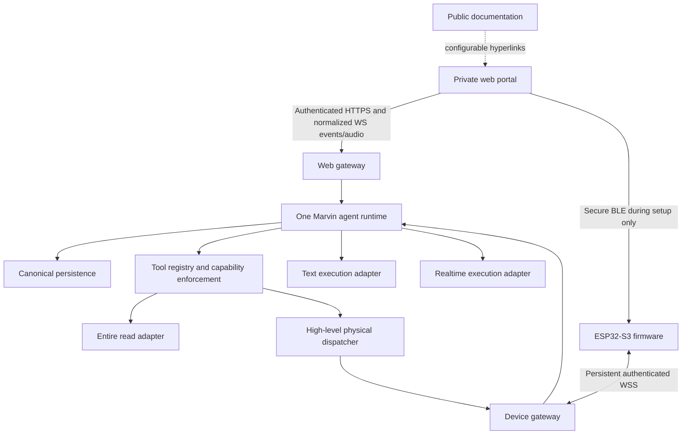

# Marvin architecture decisions

## System boundaries

Keep the MVP a TypeScript modular backend and a separate React/TypeScript portal, with ESP-IDF C/C++ firmware. M1 selects React/Vite, Fastify, pg and Node SQLite; exact dependencies are pinned in package-lock.json. The diagrams include later M4–M11 components; see delivery-status.md for implemented boundaries. The public docs are plain HTML/CSS/JS and impose no build-system requirement on the portal.

The backend owns canonical context, identity, provider credentials, Entire authorization, permission checks, and output routing. Provider protocols terminate inside model adapters. The body owns realtime hardware loops, wake word, AEC/VAD, safety, expressions, and trusted provisioning. No independently running sidecar model interprets motion intent.

## Ownership and identity

- `Owner` normalizes cloud user or single-owner local deployment identity. `ExternalIdentity(issuer, subject)` is separate from `EntireConnection`; never equate identity by email alone.
- `MarvinProfile` has one owner, a browser active conversation, and an independent optional Pet conversation link. `DeviceBinding` allows zero or one linked device per owner and one owner per device, enforced by transactional storage, not client UI.
- `Enrollment` reserves the owner's slot with a TTL and a unique device key. Pending reservations count against the one-robot limit. State transitions use compare-and-swap/transactions in both SQLite and PostgreSQL.
- Device credentials are scoped to deployment, device, binding epoch and allowed protocol operations. The device cannot choose another owner or conversation in its payload.
- Entire authentication may serve both identity and repository connection only through supported contracts. Disconnecting Entire repository access must not delete the Marvin account or hardware binding. Define reauthentication behavior separately if Entire is the identity provider.
- Local mode uses the same owner abstraction. LAN exposure still requires authenticated access; a deployment identity is not permission for every LAN client.

## Conversation and tool policy

Persist threads, normalized turns and voice transcripts, rolling summaries with coverage/version metadata, bounded tool records, repository context, and diagnostic/audit records. Provider sockets, resumption handles, audio buffers, browser routes, and cancellation handles are transient. Raw audio is not recorded by default.

Each interaction fixes authenticated owner, conversation ID, interaction ID, origin surface, repository snapshot, body identity/capabilities if applicable, provider settings, and output route. Derive these server-side. Never trust a browser-supplied `surface=body_voice` or device-supplied arbitrary owner ID.

Allow one active generation per conversation, enforced beyond a single process. Proposed UX: a second surface sees “Marvin is responding in this conversation” and may explicitly interrupt to continue; otherwise it waits. Switching surface cancels/completes and durably persists the old turn before seeding the new execution. Late deltas and playback packets are discarded by interaction/generation sequence, not rerouted. Interrupted assistant transcripts record what was delivered versus cancelled, avoiding the assumption that unheard words were communicated.

The browser active conversation changes when a conversation is chosen or created. The Pet link changes only when the owner uses the conversation-list control. On first Pet use without a link, the server atomically creates and links a conversation without changing the browser pointer. A Pet voice session captures that link when listening starts; a link change takes effect on its next session. Browser text, browser voice, and Pet turns in the same conversation share its saved context. Repository changes serialize with active generation and rebuild context; repository caches are keyed by owner/connection/repository/revision and invalidated on authorization changes.

Before model execution, expose repository reads only when authorized, and physical tools only for `body_voice` on the authenticated originating body with compatible capabilities. Revalidate permission, binding epoch, capability, deadline and safety state at dispatch. Web presentation events carry structured bounded content, never arbitrary DOM. All repository write namespaces remain disabled. Untrusted repository text/tool results must not authorize new capabilities or leak secrets.

## Model and transport contracts

Text and realtime adapters consume a canonical context package and emit normalized text/audio/transcript/tool/progress/completion/error events. They implement start, submit tool result, cancel and close; optional provider resumption stays internal. Use the same semantic tool registry and persona assets across providers. Verify supported text and realtime providers during their implementation milestones rather than freezing stale model names in the planning baseline.

Browser voice is backend-mediated. Separate bounded audio frames from control events, with backpressure, generation identifiers, and discard/flush behavior. Body audio uploads only during a locally activated conversation. Provider sessions open on demand, close on explicit exit or idle timeout, and are independent of persistent robot presence.

Physical commands are bounded semantic operations with command ID, interaction ID, binding epoch, sequence and deadline. Return accepted/rejected immediately, then completed/failed asynchronously. Do not replay expired motion after reconnection. Keep a bounded deduplication ledger and boot/session fencing so device resets cannot re-execute old actions. A drive duration has a local deadline even if every remote component disappears.

## Persistence and operations

Use PostgreSQL for cloud and SQLite for a single-node local stack behind narrow repositories and a shared conformance suite. Do not presume identical SQL/locking behavior; use mode-specific migrations and transactional implementations. No distributed local database or fleet architecture is needed for MVP.

Use server-held sessions in secure, HttpOnly, appropriately SameSite cookies; CSRF/origin validation for mutations and WS upgrades; approved redirect allowlists; rate limits; encrypted Entire/provider credentials; tenant-scoped queries. Device API auth remains separate. Long-lived provider and Entire credentials are never shipped to firmware or browser storage.

Define retention values in M1 and expose them in M11. Suggested starting configuration: transcripts retained until user deletion or a chosen retention limit; diagnostic logs 14 days; bounded tool payloads 7 days; no durable raw audio. Treat these as configurable proposals, validate storage/privacy needs, and document backup expiry. Error logging must redact network passwords, tokens, repository bodies, and sensitive query parameters.

Cloud and local deployment use the same domain modules with different identity, persistence, secret-store and endpoint configuration. Local setup validates a LAN-reachable endpoint, TLS trust, port/firewall reachability, and microphone/BLE secure-context requirements. An ESP32's `localhost` is the ESP32, not the owner's laptop.

## Sources and decision provenance

The source specification v2.0 provides product, runtime, firmware and persistence boundaries. The latest user request overrides future multi-body assumptions and adds explicit robot-scanned Wi-Fi and same-owner reconfiguration. The implemented docs CSS provides visual reference; its older design brief and legacy controller protocol do not define this portal's runtime.

Current provisioning references checked 12 September 2026 are linked beside the claims in `experience-and-provisioning.md`. Entire remains an integration discovery item: public CLI authentication material is not evidence of supported third-party identity federation. No Entire client ID, endpoint shape, graph API or scope is invented in this plan.
