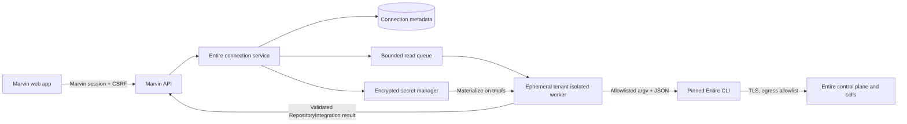
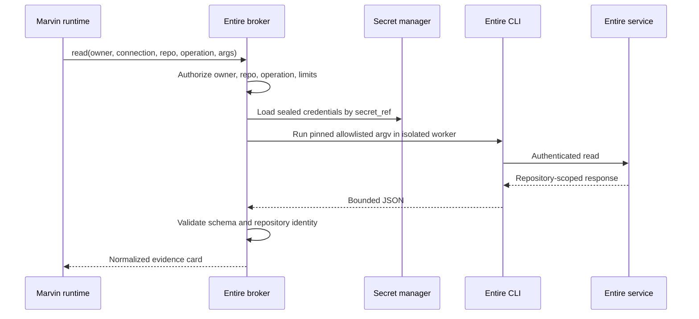
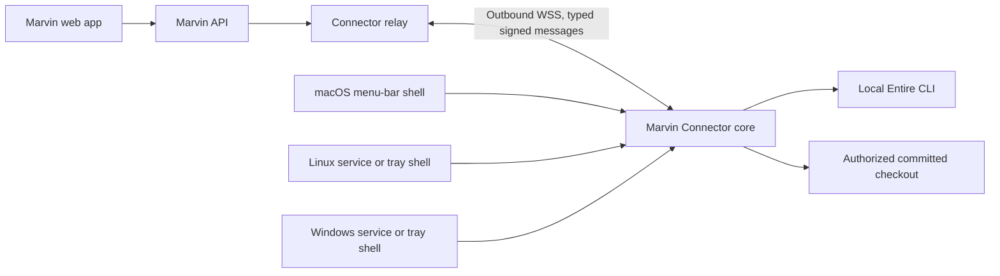

# ADR 0005 — Connect cloud Marvin to Entire through a hosted CLI broker

Status: implemented behind deployment configuration; production enablement still requires Entire approval and a pinned-CLI compatibility gate. 22 September 2026.

## Implementation status

Marvin now includes the two paths selected by this decision:

- The cloud server can start Entire's device-code login, store the resulting CLI token bundle in an encrypted filesystem envelope outside PostgreSQL, and perform serialized, bounded, read-only CLI calls for repository listing, search, and checkpoint metadata.
- A portable Go connector can instead use a user's existing local Entire CLI login over an outbound WebSocket. It accepts only the versioned repository operations Marvin already authorizes; it has no remote-shell operation. A macOS status-bar app wraps this connector core.
- Settings prefer cloud sign-in and expose the local connector as a fallback. One-time connector pairing codes are hashed in PostgreSQL, expire after ten minutes, and are consumed once. The durable connector credential is separately revocable.

The hosted implementation is deliberately feature-gated because the remaining Phase 0 product-policy questions are external to Marvin. The current encrypted file envelope is suitable for a single durable server volume; a horizontally scaled production deployment should replace it with a KMS-backed secret manager and distributed per-connection locking before enabling hosted sign-in broadly.

## Decision

Do not build a macOS-only menu-bar relay as the primary cloud integration.

The preferred architecture is a **hosted Entire CLI broker** inside Marvin's cloud boundary. Each Marvin owner explicitly authorizes a separate Entire connection using Entire's device-code login. Marvin stores the resulting refreshable CLI login in a tenant-scoped secret store and invokes a pinned Entire CLI in an isolated worker for bounded, read-only operations. The user does not need to keep a computer online, and the design works regardless of the machine on which they write code.

This decision is conditional. Before production, Entire must confirm that its headless CLI login and remote read commands are supported for a multi-tenant third-party SaaS. Its public CLI documentation establishes headless use, device login, file-backed token storage, and non-interactive tokens; it does **not** explicitly grant Marvin a third-party OAuth client or promise a stable SaaS integration contract. Until that confirmation, the hosted broker is an engineering candidate, not an approved production integration.

If Entire does not approve hosted delegated use, build a **cross-platform Marvin Connector** that maintains an outbound encrypted connection from a user-controlled macOS, Linux, or Windows machine. The connector core must be a headless service; a macOS menu-bar panel is an optional shell around it. It exposes a small typed repository-read protocol, never a remote shell.

Do not ask users to paste the output of `entire auth token` into the Marvin web application. That output is a live bearer credential, is awkward to rotate or revoke safely, and encourages credentials to pass through browser history, clipboard managers, support captures, and application logs.

## What changed since ADR 0004

[ADR 0004](0004-entire-integration.md) correctly rejected reusing the CLI's OAuth client, website cookies, or undocumented website endpoints as though they were a supported hosted API.

New public CLI capabilities materially improve the options:

- Entire documents headless login through `entire login --device` and a file-backed token store for machines without a browser or keyring.
- Entire documents `ENTIRE_TOKEN` for CI and workload identity. It accepts a login or service-account session JWT and bypasses local credential storage.
- The CLI is distributed for macOS, Linux, and Windows.
- `entire search --repo ... --compact` performs repository-scoped remote search without relying on a user's current working tree.
- Since CLI 0.10.0, `entire checkpoint explain <id> --repo <owner/name> --json` can read a pushed checkpoint from that repository's Entire API without a local checkout.
- Control-plane repository listing has structured JSON and pagination.

These features mean the CLI can potentially act as Marvin's supported client library on a headless cloud worker. They do not make `https://entire.io/api/openapi.json` a supported third-party API, and they do not answer the product-policy question of multi-tenant delegated use.

Sources checked on 22 September 2026:

- [Entire CLI README: headless and CI authentication](https://github.com/entireio/cli/blob/main/README.md#headless--ci-authentication)
- [Entire CLI changelog](https://github.com/entireio/cli/blob/main/CHANGELOG.md)
- [Entire CLI repository and platform installation](https://github.com/entireio/cli)
- [OAuth 2.0 Device Authorization Grant, RFC 8628](https://www.rfc-editor.org/rfc/rfc8628.html)
- [OAuth 2.0 Security Best Current Practice, RFC 9700](https://www.rfc-editor.org/rfc/rfc9700.html)

The installed CLI used for local inspection was 0.10.6 and reported that 0.11.0 was available. Production must pin an exact checksum-tested release and run compatibility tests before every upgrade.

## Options considered

| Option | User computer required | Platform coverage | Credential exposure to Marvin | Availability | Decision |
| --- | --- | --- | --- | --- | --- |
| Entire-issued OAuth/API integration | No | All | Delegated token | Best | Desired long-term contract; ask Entire first |
| Hosted CLI broker with device login | No | All | Refreshable CLI login | High | Preferred implementation, conditional on Entire approval |
| Hosted CLI with user-pasted bearer token | No | All | Raw bearer copied through browser | Token lifetime | Reject for consumer UX; allow only an operator-managed service-account mode if Entire supports it |
| Cross-platform outbound connector | Yes, while reads run | macOS/Linux/Windows | Entire login remains on user machine | Depends on device | Fallback and optional local-source mode |
| macOS-only menu-bar connector | Yes | macOS only | Entire login remains on Mac | Depends on Mac | UI shell only, not the core architecture |
| Periodic export/synchronization | Only during sync | Potentially all | Varies | Stale between syncs | Possible optimization, not the source of authorization truth |
| Browser extension or website-cookie reuse | Browser required | Browser-specific | Browser session/cookies | Fragile | Reject |

## Product boundary

Marvin identity and Entire authorization remain separate even when both happen to use GitHub:

- GitHub sign-in tells Marvin who is using Marvin.
- Entire authorization tells Entire which repositories that person may read.
- Never join the accounts by email, GitHub username, or display name.
- Disconnecting Entire must not sign the user out of Marvin or delete conversations.
- Revoking Marvin's GitHub session must not be treated as revoking Entire, and vice versa.

The initial cloud capability is read-only:

- list repositories visible to the Entire connection;
- verify that a selected repository remains visible;
- perform bounded indexed history and code search;
- fetch bounded checkpoint metadata using a full checkpoint identifier;
- optionally read committed source from a separately authorized cloud clone.

It must not enable Entire hooks, capture sessions, modify grants, create mirrors, alter repositories, run review agents, fetch full transcripts by default, or expose the generic `entire api` passthrough.

## Preferred architecture: hosted CLI broker



Keep the existing `RepositoryIntegration` boundary. Add `EntireHostedCli`, whose public methods remain `configured`, `connect`, `check`, `discover`, `read`, and `invalidate`. It submits operations to the broker rather than starting a process in the API server.

### Components

1. **Connection controller**
   Owns connect, reconnect, status, and disconnect HTTP endpoints. It binds every operation to the authenticated Marvin `ownerId`; a browser never supplies an owner ID.

2. **Login orchestrator**
   Starts one short-lived, tenant-isolated `entire login --device` process with file-backed token storage. It relays only the verification URL, user code, expiry, and status to the Marvin UI. It never relays token bytes. A production implementation needs either a machine-readable login mode from Entire or an explicitly supported login protocol; scraping human terminal output is acceptable only in a prototype.

3. **Secret envelope store**
   Stores each connection's Entire token-store payload outside PostgreSQL, encrypted with a cloud KMS key and addressed by an opaque `secret_ref`. A worker materializes it to a per-job in-memory filesystem with mode `0600`, then destroys the job directory. If the CLI rotates a refresh token, replace the secret atomically while holding the connection lock.

4. **Read broker and worker pool**
   Accepts only versioned typed operations. Workers run as a non-root user with a read-only image, no host mounts, a temporary home directory, strict CPU/memory/output/time limits, and outbound network access restricted to discovered-and-validated Entire domains. The worker image contains a checksum-pinned Entire CLI and Git only when a source clone is required.

5. **Result normalizer**
   Parses operation-specific JSON into the existing `Repository`, `RepoCard`, and `Evidence` schemas. It fails closed on unknown shapes, cross-repository results, excess output, invalid paths, or missing repository identity.

6. **Repository metadata cache**
   Caches repository catalog and capability metadata for a short TTL, keyed by connection and external repository identity. Authorization is rechecked before every content read. Do not proactively cache full transcripts or source trees merely to improve latency.

### Login flow

```mermaid
sequenceDiagram
  participant U as User
  participant W as Marvin web
  participant A as Marvin API
  participant J as Login worker
  participant E as Entire

  U->>W: Connect Entire
  W->>A: POST /api/entire/connections
  A->>J: Start isolated device login
  J->>E: Begin device authorization
  E-->>J: Verification URI, user code, expiry
  J-->>A: Public login instructions only
  A-->>W: Attempt ID and instructions
  U->>E: Open official Entire page and approve
  J->>E: Poll at server-provided interval
  E-->>J: Login and refresh material
  J->>A: Seal token store; report identity metadata
  A->>A: Verify repository listing
  A-->>W: Connected repositories
```

The browser should show the official Entire hostname prominently, the expiring user code, a cancel action, and a warning to approve only the connection it just initiated. Device authorization is designed for this separated flow, but it is also susceptible to social-engineering if codes are detached from user intent. Follow Entire's polling interval and expiry and bind each attempt to the current Marvin session.

### Read flow



Do not hold a WebSocket open to Entire. CLI reads are ordinary request/response jobs. Marvin's existing browser sockets may continue to carry agent progress, but the integration itself should use a queue plus bounded worker calls. Use proactive fetch only for the small repository catalog; fetch content on demand.

### Cloud command mapping

The exact argv is a versioned implementation detail and must be established by contract tests against the pinned CLI. The intended mapping is:

| Marvin operation | Entire CLI capability | Local checkout required |
| --- | --- | --- |
| Discover repositories | mirror/repository list with JSON pagination | No |
| Verify repository | repository detail or exact list match | No |
| Search history | `search --repo ... --compact` | No |
| Search indexed code | `search --repo ... --code --json` | No |
| Read checkpoint metadata | `checkpoint explain <full-id> --repo ... --json` | No, for pushed checkpoints |
| Read committed source | ephemeral authorized clone plus bounded Git object read | Yes, but in cloud rather than on the user's laptop |

For committed source, prefer one of these separately authorized paths, in order:

1. an Entire-supported read/clone path for the selected repository;
2. a Marvin GitHub App installation with read-only `Contents` access to explicitly selected repositories;
3. the cross-platform connector reading the user's committed local checkout.

Marvin's existing GitHub login is authentication, not repository-content authorization. Do not silently widen its scopes. If the product can tolerate indexed evidence without revision-pinned source, omit source reads from the first hosted release.

## Persistence model

Add metadata tables; do not put token payloads in them.

### `entire_connections`

- `id` — random Marvin identifier;
- `owner_id` — foreign key and tenant boundary;
- `status` — `pending`, `connected`, `reauth_required`, `revoked`, or `error`;
- `auth_kind` — initially `device_login`; reserve `service_account` for an Entire-approved enterprise mode;
- `secret_ref` — opaque secret-manager reference, nullable outside `connected`/`reauth_required`;
- `entire_subject` and `home_jurisdiction` — only values returned by supported CLI JSON, never inferred from Marvin identity;
- `cli_version` and `contract_version`;
- `created_at`, `connected_at`, `last_verified_at`, `revoked_at`;
- `version` — optimistic concurrency fence for refresh-token rotation.

Enforce at most one active Entire connection per Marvin owner for the first release. A later multi-account feature can make connection selection explicit.

### `entire_repositories`

- `connection_id`;
- stable external repository identity when Entire supplies one;
- canonical forge-qualified name such as `gh/owner/repo` or `et/project/repo`;
- Marvin repository ID derived from connection plus stable external identity, not name alone;
- capabilities and last-seen timestamp;
- visibility state: `available`, `removed`, or `suspended`.

### `entire_login_attempts`

Persist only a hash of the attempt token, owner, status, expiry, and timestamps. Keep device codes and terminal output in short-lived worker memory. Delete or expire attempts promptly.

Audit connection creation, successful authorization, reauthentication, disconnect, repository selection, and authorization denial. Do not audit query text, source excerpts, codes, or credentials.

## Authorization and isolation rules

- The selected connection always comes from the authenticated owner record.
- Repository IDs are opaque Marvin IDs; resolve them server-side to a canonical Entire identity.
- Check repository access immediately before each content operation, including cache hits.
- Serialize CLI use per connection when token rotation may occur. Reads for different connections can run concurrently under global and per-tenant quotas.
- Allowlist every executable and argument shape. Never accept an arbitrary command, flag, URL, filesystem path, environment variable, or working directory from the model or browser.
- Disable TTY prompts, pagers, Git credential prompts, user Git configuration, plugins, hooks, and telemetry where supported.
- Bound process time, stdout/stderr bytes, result count, source size, line range, pagination depth, and total concurrent jobs.
- Treat repository content and Entire output as untrusted evidence, not instructions.
- Redact bearer strings and known key formats from diagnostics, while recognizing that regex redaction is only defense in depth.
- Egress discovery must validate HTTPS, registrable-domain expectations, redirects, and resolved IPs to prevent SSRF or token forwarding to an attacker-controlled host.
- On disconnect, revoke through a supported Entire command if one exists, delete the secret, invalidate caches, clear selected repositories from future context, and fence in-flight results. Preserve conversations.
- Account deletion must perform the same cleanup. Backup deletion follows Marvin's documented retention policy.

RFC 9700 recommends least-privilege, audience-restricted access tokens and replay protection for refresh tokens. Marvin cannot add those properties to Entire's tokens; ask Entire what scopes, audience restrictions, refresh rotation, revocation, and sender constraints its CLI login provides, then reflect the answer in the threat model.

## Fallback architecture: cross-platform Marvin Connector

Use this only if Entire rejects the hosted broker, or as an optional mode for local-only repositories and exact local committed-source reads.



### Packaging

- Implement one small, signed connector core in Go or Rust for macOS, Linux, and Windows.
- Support headless execution under `launchd`, `systemd`, and Windows Service Manager.
- Add a native macOS menu-bar shell for status, pairing, pause/resume, diagnostics, update, and quit. It is not responsible for the protocol or CLI execution.
- Add Windows tray and Linux tray packages only if demand justifies them; the headless service remains fully usable.
- Publish signed, notarized packages with automatic updates, rollback, and a minimum-version policy.

### Pairing

Prefer browser-based one-time pairing over a user-pasted permanent API key:

1. Connector generates a device key pair in the OS credential store.
2. Connector opens Marvin's HTTPS pairing page with a short-lived random challenge.
3. The already signed-in user approves the named machine.
4. Marvin records the device public key and issues a revocable connector credential bound to owner and device.
5. Connector opens an outbound `wss://` session and proves possession of its key.

GitHub OAuth may authenticate the user to Marvin during pairing. It does not authenticate the connector to Entire. Entire stays logged in through the local CLI/keychain.

### Relay protocol

Version the protocol independently of the app. Minimum message types are `hello`, `ready`, `request`, `cancel`, `result`, `error`, `heartbeat`, and `reauth_required`.

A request contains a random request ID, connection-device ID, operation enum, opaque Marvin repository ID, validated operation arguments, issue time, deadline, and server signature. The connector maps it to a fixed CLI invocation. A result echoes the request ID and includes the canonical repository identity, structured bounded payload, CLI version, and completion status.

The server must never send shell text. The connector must never return arbitrary files. Reject unknown operations and versions. Permit one active connection per device, bounded in-flight work, deadlines, cancellation, replay detection, and backpressure. Revalidate authorization on the server both before dispatch and before accepting a result.

### Relay tradeoffs

The connector keeps Entire credentials and local source on the user's machine and works behind NAT because it dials out. It also introduces offline failures, laptop sleep, corporate firewalls, binary distribution, auto-update security, local malware exposure, support burden, and latency. For these reasons it is a fallback or an explicit "use this machine" capability, not the default account connection.

## Operational behavior

Connection status should distinguish:

- `connected` — credentials verified recently;
- `reauth_required` — Entire rejected or could not refresh the login;
- `temporarily_unavailable` — worker, relay, or Entire service is unavailable;
- `repository_removed` — connection works but the selected repository no longer does;
- `connector_offline` — only for connector mode;
- `unsupported_cli` — compatibility policy blocks the installed/pinned version.

Do not label a connection "disconnected" merely because one read timed out. Use retryable errors with bounded exponential backoff and jitter for service failures, but do not retry authorization failures or non-idempotent commands. The first release has no Entire write operations.

Measure connection success, auth completion time, command latency by operation, queue time, timeout/rate-limit/error class, schema mismatch, cache hit rate, and reauthentication frequency. Metrics must not contain repository names, query text, code, checkpoint contents, user codes, or tokens.

## Delivery plan

### Phase 0 — Entire contract and feasibility

Ask Entire to confirm in writing:

1. May a multi-tenant SaaS run the public CLI on behalf of individual users after device-code authorization?
2. Is the `entire-cli` device client intended for that use, or can Marvin register its own OAuth client?
3. Is there a machine-readable way to start and observe device login without scraping terminal text?
4. What scopes and audiences are issued, how are refresh tokens rotated, and how are sessions revoked?
5. Is there an approved service-account or workload-identity flow for user- or organization-delegated read access?
6. Which JSON command outputs and pagination/error contracts are stable for external automation?
7. What rate limits and CLI minimum-version policy apply?
8. Can repository identity be returned as an immutable ID across rename and forge namespaces?
9. Which domains may receive a login or jurisdiction token, and how should clients validate cell discovery?
10. May Marvin cache repository metadata or evidence, and what deletion obligations apply?

In parallel, build a disposable spike—not production auth—that runs a pinned CLI in an isolated Linux container, completes device login to a temporary file-backed store, lists repositories, performs remote search, reads a pushed checkpoint, refreshes once, revokes/logout, and verifies that no credential appears in logs.

Exit criterion: written support boundary plus a reproducible compatibility report. If Entire rejects or cannot clarify hosted use, choose the connector path.

### Phase 1 — Hosted read-only alpha

- Add connection metadata and secret-manager integration.
- Add device-login orchestration with an approved machine-readable contract.
- Implement repository discovery, verification, indexed search, and remote checkpoint metadata.
- Omit exact source reads unless an independently authorized cloud clone is available.
- Pin CLI version and checksum; deploy compatibility canary tests before upgrades.
- Restrict alpha to a small allowlist and one Entire connection per owner.

### Phase 2 — Source and resilience

- Add explicitly authorized, read-only cloud clones or connector-assisted local source.
- Add distributed per-connection locks, quotas, circuit breaking, and short metadata caches.
- Exercise token expiry, refresh rotation, revocation, repository removal/rename, rate limits, cell failover, worker crashes, and account deletion.
- Validate with two authorized Entire accounts and one denied account to prove tenant separation.

### Phase 3 — Optional connector

Build only for confirmed needs: local-only repositories, customer policy forbidding hosted credentials, or Entire declining hosted delegation. Ship headless macOS/Linux/Windows support before treating the Mac menu-bar UI as complete.

## Acceptance gates

The cloud connection is not production-ready until all of these pass:

- Entire has approved the chosen authentication and automation contract.
- Credentials never enter browser JavaScript, PostgreSQL, model context, logs, analytics, crash reports, or support bundles.
- Cross-tenant tests cannot list, select, cache, or read another owner's repository.
- Every operation is repository-scoped and rejects a mismatched repository response.
- Refresh rotation is atomic under concurrent reads; stale-token replay produces reauthentication rather than credential loss.
- Disconnect, Entire-side revocation, Marvin account deletion, and repository permission removal take effect without relying on cache expiry alone.
- Worker sandbox, egress allowlist, output limits, timeouts, cancellation, and queue quotas have adversarial tests.
- CLI upgrade tests cover every accepted JSON schema and error mapping before rollout.
- The UI accurately distinguishes reauthentication, temporary service failure, repository removal, and optional connector offline state.
- A privacy review covers Entire evidence sent to the configured model provider and the retention of cached metadata.

## Consequences

The preferred design removes the Mac-only and "computer must be awake" constraints without inventing an Entire web API. It reuses Marvin's existing repository abstraction and much of the current CLI parser and policy code. It also makes Marvin a custodian of delegated Entire credentials, which raises the security and operational bar substantially.

The connector fallback avoids hosted Entire credentials and provides local committed source, but it is a distributed client product with availability and update costs. Separating its portable core from the macOS menu-bar shell prevents an early UI choice from becoming a platform limitation.

ADR 0004 remains correct for the current local adapter. This ADR adds the proposed cloud path; it does not authorize hosted production use until the Phase 0 gate is satisfied.
