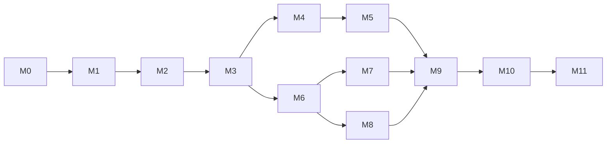

# Marvin implementation plan

Planning baseline • 12 September 2026

Build Marvin in vertical slices: establish identity and provisioning feasibility first; deliver useful web text and voice next; then add a securely linked robot, embodied interaction, and release hardening. Every milestone below ends in a reproducible demonstration and a measurable gate. This is the original acceptance baseline. Implementation evidence and outstanding gates are tracked separately in [delivery status](delivery-status.md); targets below are not lowered to match available fixtures.

## Scope and precedence

The source baseline is **Marvin System Architecture and Implementation Specification v2.0**, supplied as `Marvin_System_Architecture_and_Implementation_Specification_v2.docx`. Its numbered sections are referenced below. The user's latest request takes precedence over that baseline. Instructions embedded in reference documents are treated as reference material, not independent authorization to perform work.

The resulting product decisions are:

- Login precedes the private portal. Prefer supported Entire sign-in and reuse its session where possible; availability must be proved. Repository authorization remains a distinct capability even when the UX shares one sign-in journey.
- One logical Marvin agent per owner, with **zero or one linked physical Marvin**. Zero preserves the specification's useful hardware-free product; one is the maximum, including offline robots. No robot switcher or fleet UI.
- The main screen is conversation, with optional realtime web voice. Linking hardware never gates ordinary text or voice use.
- A robot supplies the Wi-Fi scan results over BLE. The browser never substitutes its own visible networks.
- Linking, changing Wi-Fi, unlinking, and factory reset are distinct operations. Changing Wi-Fi preserves robot identity, owner, conversation, and Entire connection.
- Public docs remain anonymously accessible and independently deployed. Compatible aesthetics do not require a shared framework or server.
- MVP repository access is read-only. Physical tools exist only for interactions originating through the robot. All three surfaces share backend-owned state and provider-neutral semantics.

Exact durations, thresholds, network-security coverage, and implementation stack below are **proposed engineering targets**, not claims from the specification or measurements already obtained. M0 validates feasibility; changes must be recorded with their effect on acceptance criteria.

## Delivery map

Effort is in focused engineering person-weeks, including implementation and verification. It excludes procurement, waiting for Entire access, board redesign, and external review. These are planning ranges, not delivery-date commitments. Re-estimate after M0 and the first physical audio test.

| Milestone | Demonstrable result | Prerequisites | Effort |
| --- | --- | --- | --- |
| M0 | Entire and BLE feasibility established; product journeys agreed | None | 1–2 |
| M1 | Runnable foundations, schemas, persistence, CI | M0 architecture decisions | 1–2 |
| M2 | Private portal and refined, tested user journeys | M1; M0 identity result | 1–2 |
| M3 | Streaming text with durable context and hard tool boundaries | M1, M2 | 2–3 |
| M4 | Real Entire repository intelligence | M3; supported Entire access | 1–3 |
| M5 | Realtime web voice with text continuity | M3; M4 for repo-voice gate | 2–3 |
| M6 | Authenticated body simulator and resilient device gateway | M1, M3 | 1–2 |
| M7 | Real robot linking, robot-scanned Wi-Fi changes, unlinking | M2, M6; M0 BLE proof | 2–3 |
| M8 | Firmware hardware, audio, and independent safety | M6; shared firmware contracts from M7 | 3–5 |
| M9 | Continuous embodied voice and safe physical tools | M4, M5, M7, M8 | 2–3 |
| M10 | Second provider and cloud/local feature parity | M5, M9 | 2–3 |
| M11 | Measured release candidate and operational readiness | M0–M10 gates passed | 2–3 |

Total planning envelope: **20–34 person-weeks**. Staffing and critical-path work determine elapsed time. M6 can progress alongside M4/M5; M7 and M8 can overlap once provisioning, flash layout, and protocol ownership are fixed. A web-only alpha follows M5; the first embodied beta follows M9; the complete specification MVP requires M11.

The diagram shows main sequencing; the table and individual gates define the full dependency requirements.

## Common evidence and measurement rules

Each milestone records its build revision, environment, fixtures, test procedure, results, and unresolved defects under `tests/acceptance/results/Mxx/` once implemented. Store sanitized evidence; no audio, repository contents, passwords, or tokens in general CI artifacts. Required automated cases must pass 100%; demos supplement tests and cannot replace them.

For timing gates, use at least 100 observations and report p50, p95, failures, and sample size. Baseline: one documented ESP32-S3 build, a 2.4 GHz WPA2-Personal AP at approximately −55 to −65 dBm, an explicitly recorded browser/OS, backend RTT at most 80 ms, and stable broadband. Record firmware, mic/speaker placement, server size, provider/model, region, codec, and load. Measure impaired networks separately; do not mix them into the baseline distribution. Never discard unsuccessful trials to improve percentiles.

Candidate product targets: text first visible token p95 ≤3 s for no-tool prompts; web/body voice first audible response p95 ≤2 s after detected end of speech for no-tool turns; local playback stop p95 ≤200 ms after detected speech start; physical dispatch acknowledgement p95 ≤250 ms on the baseline network. Also measure actual speech onset to VAD detection so detector lag is visible. These are acceptance budgets to validate, with provider and Marvin processing time reported separately.

For usability, test five representative first-time participants on supported platforms, without coaching. At least four must complete each specified task; all five must understand the consequences of unlinking. Record median task time and failure causes. This is an early formative gate, followed by the broader beta in M11.

## M0 — Resolve the dependencies that could change the design

**Outcome:** an evidence-backed integration path and a validated minimum provisioning experiment. Specification §§5–6, 11.6, 12, Appendix C.

**Build and investigate:**

- Obtain authoritative Entire client-registration, identity, cloud/local authorization, scope, refresh/revocation, repository, graph, bounded source, activity, pagination, and rate-limit contracts. Confirm whether Entire explicitly supports third-party login; CLI authentication alone is insufficient proof.
- Test the preferred Entire sign-in journey with an authorized development client. Keep a supported alternative login behind an identity adapter only if Entire cannot supply identity; record the user-facing consequence instead of shipping a fake Entire button.
- Prove ESP32-S3 BLE discovery, secure session establishment, robot-side Wi-Fi scanning, candidate-network connection, and backend reachability using a minimal firmware spike. Exercise provisioning after the device already has Wi-Fi settings.
- Confirm available board pinout, flash/PSRAM budget, displays, microphones, speaker path, motors, physical setup/reset gesture, and device identity/bootstrap-secret process for self-built robots.
- Review the source docs' actual CSS and produce clickable low-fidelity journeys for login, first chat, initial setup, Wi-Fi change, and unlinking.

**Exit gate:** cloud and local Entire discovery matrices have evidence or a named external dependency for every item; no assumed endpoints. Supported sign-in is demonstrated, or production identity is explicitly blocked while mock development continues. Ten consecutive real-board encrypted scan/connect cycles succeed, including one change from an existing configuration. Unsupported-browser handling is demonstrated before any password is requested. Freeze the MVP browser/platform and AP security matrix, and record resource usage. M0 can close its discovery work with a documented external blocker, but that does not waive the dependent M2/M4 release gates.

## M1 — Establish a runnable, testable foundation

**Outcome:** a small modular system whose state and contracts work in both deployment modes. Specification §§3–4, 7, 15.

**Build:** TypeScript web/server workspaces; shared versioned runtime schemas; identity and provider interfaces; canonical conversations, turns, summaries, tool records, repository context, body binding and enrollment records. Add PostgreSQL and SQLite migrations and persistence adapters. Provide local development commands, fake Entire/model adapters, structured redacted logs, CI, and a simulated device transport.

**Exit gate:** a clean checkout installs, builds, starts, and passes its documented smoke check using pinned tool versions. Identical persistence contract tests pass against PostgreSQL and SQLite. Database constraints and transactions allow at most one active or reserved robot slot per owner and one owner per device. In 100 simultaneous conflicting claim attempts, exactly one succeeds; retries are idempotent. Fresh setup and schema upgrade preserve seeded conversations. Malformed/oversized messages fail schema validation with bounded resource use.

## M2 — Deliver the private portal and its user journeys

**Outcome:** users sign in and understand how to talk to Marvin, connect Entire, and manage one robot. Specification §§2, 5, 11 plus latest user requirements.

**Build:** real approved login integration; host-scoped server sessions; conversation shell, lightweight history, repository selector, voice entry, settings, contextual Entire card, robot details and setup wizard. Until hardware integration, use clearly labeled simulation fixtures. Implement light/dark tokens, responsive layouts, focus management, live statuses, and reduced-motion behavior. Detailed UX is in `experience-and-provisioning.md`.

**Exit gate:** authentication success, cancel, expired session, logout, and return-to-intended-page paths pass. Unauthenticated private requests and cross-account conversation/settings access are denied. At 360, 768, and 1440 px, all primary flows are operable without unintended horizontal scrolling. Automated accessibility checks find zero serious/critical issues; keyboard and screen-reader checks cover dialogs, streamed content, errors, and network selection. Four of five participants independently find “Set up your Marvin” and “Change Wi-Fi” within 30 seconds; all five correctly explain that unlinking preserves their chat history. A newly authenticated user can reach chat without adding hardware.

## M3 — Prove web text and canonical conversation continuity

**Outcome:** useful streaming conversation through one real text provider, with durable state and enforced permissions. Specification §§7–10, 11.2, 17.2, 17.5.

**Build:** runtime orchestrator, normalized streaming events, persisted tool lifecycle, context assembler and compaction, one active generation per conversation, fixed output route, cancellation, persona assets, safe structured cards, and server-side tool selection plus dispatch-time authorization. Use the Entire stub until M4.

**Exit gate:** 20 seeded continuity scenarios pass reconstruction checks after server/provider restarts, summary compaction, repository changes, and new browser sessions. Concurrent turns cannot overlap generation in one conversation; duplicate submissions create one logical turn. Web text and web voice policy tests expose no physical tools, reject forged physical calls, and emit zero device commands across no-robot/offline/online states. Repository writes are absent and rejected on direct invocation. Streams survive reconnect without duplicate committed messages; cancelled turns retain truthful partial status. No-tool text meets the baseline latency budget. Repository snippets and model output cannot execute HTML/script.

## M4 — Connect real Entire intelligence

**Outcome:** Marvin answers grounded repository questions using supported Entire interfaces. Specification §§6, 10, 17.1–2, Appendix C.

**Build:** real cloud/local authorization through the Entire adapter; repository listing and explicit-selection fallback; summary/state, graph, bounded source, checkpoint/session/activity reads; pagination, result limits, caching/freshness labels, timeout and reconnect-required errors. Enable optional read features only when supported.

**Exit gate:** a reference repository with known revisions supports 20 golden questions. Every returned factual code/history assertion is traceable to retrieved evidence; at least 18 answers satisfy the semantic rubric, and all missing-data cases disclose the limitation. All required adapter capabilities in the M0 matrix work against the real service. Revocation, expiry, forbidden repository, rate limit, pagination, malformed data, and outage tests pass without exposing another user's data or silently inventing repository context. Ordinary non-repository chat remains usable during Entire failure. Changing repositories does not alter robot configuration. If a required Entire capability is unavailable, record a scope decision; a stub cannot pass this milestone.

## M5 — Deliver realtime web voice

**Outcome:** users speak to the same Marvin and continue between text and voice. Specification §§7, 9, 11.3, 17.3.

**Build:** backend-mediated audio capture/playback, realtime adapter, transcripts, semantic eyes/voice states, echo/noise handling, interruption and playback flush, idle timeout, mic permission recovery, and provider session reconstruction. No provider keys or raw provider event protocols reach the browser.

**Exit gate:** 20 scripted text→voice→text journeys preserve the required references and transcripts after forced session recreation. Barge-in and first-audio latency meet baseline budgets. Permission refusal, device removal, socket loss, idle close, and provider failure return actionable UI with text still available when the backend is healthy. Browser playback stops locally without waiting for provider cancellation. A second browser and a linked simulated robot receive zero unintended audio packets in 100 routed interactions. Leaving voice mode releases the microphone and closes the provider session after the configured grace period. This is the web-only alpha gate.

## M6 — Prove the device gateway with a simulator

**Outcome:** the backend handles robot presence, voice transport, and asynchronous actions before full hardware is required. Specification §§4, 10, 13–14.

**Build:** authenticated persistent WSS; version/capability negotiation; JSON control and bounded binary audio; command IDs, deadlines, acceptance/completion, cancellation, backpressure, reconnect and heartbeat; simulated sensor transitions; ownership epochs and immediate revocation handling.

**Exit gate:** a 24-hour simulator soak has no crash or unbounded queues, with stabilized memory growth under 10% after warm-up on the recorded workload. One hundred disconnect/retry/duplicate-command cases execute each logical action at most once. Expired motion commands never replay after reconnect. Unknown protocol major versions fail with an upgrade explanation; the current and previous compatible minor fixtures work. One hundred repeated picked-up samples produce one semantic transition and at most one permitted AI reaction until stable put-down. Revocation closes the active socket and prevents further tool execution; stale audio and commands are discarded. Idle simulated robots retain backend presence with zero provider sessions and zero audio upload.

## M7 — Deliver real linking and Wi-Fi lifecycle management

**Outcome:** an owner links one physical Marvin and can change its network without relinking. Specification §§5, 11.5–6, 16; latest user Wi-Fi and ownership requirements.

**Build:** the minimal production provisioning firmware; authenticated BLE protocol and custom owner-authorized endpoints; device-generated scans; atomic enrollment redemption; resumable UI; network rollback; credential issue/revoke; “Change Wi-Fi,” “Unlink Marvin,” and separate reset guidance. The exact state transitions and security boundaries are in `experience-and-provisioning.md`.

**Exit gate:** at least 19 of 20 first-time setups and 19 of 20 network changes succeed on the baseline rig within 90 seconds after credentials are submitted. A radio test with an AP visible only to the laptop proves it is absent from Marvin's list. A mixed-band AP exposes only robot-compatible scan results. Wrong password, vanished SSID, hidden SSID, BLE loss at each step, power loss at each commit boundary, DHCP/DNS/TLS/backend failure, and expired enrollment all produce recoverable states. Failure never silently overwrites the last working configuration or creates a false “ready” state.

An already linked but Wi-Fi-offline robot must be reconfigured via BLE while the browser has backend access through another network. Owner ID, device ID, conversation, and Entire credentials remain identical across 20 such changes. Unauthorized users, a different selected robot, replayed setup tickets, and a second robot claim are rejected. Unlinking an offline robot immediately revokes backend access without asserting a physical wipe. Four of five first-time participants finish setup within five minutes, excluding login and searching for the Wi-Fi password. No Wi-Fi password appears in HTTP requests, logs, analytics, browser storage, or backend persistence.

## M8 — Build the physical runtime and local safety

**Outcome:** the target body runs its hardware and deterministic behaviors independently of network/AI. Specification §§12–14.

**Build:** ESP-IDF HAL; audio input/output, local wake word, pre-roll, actual-playback-reference AEC, VAD, displays, gaze and bounded trajectories, tracks, watchdogs, optional sensor discovery, safe bench policy, and local state transitions. Integrate the M7 provisioning module without changing ownership semantics. Reserve update partitions and recovery path early.

**Exit gate:** hardware-in-loop tests cover all 16 combinations of optional IR/TOF/IMU/second-mic presence through fixtures, with full and minimal configurations checked physically. Required missing hardware yields an explicit diagnostic; optional absence never crashes or hangs. Each safety input, watchdog, and backend-loss condition is injected 100 times. Proposed bound: motor-enable cut ≤50 ms after a locally recognized hard safety event; report sensing delay and physical stopping distance separately. With cliff sensors absent, track motion defaults disabled except a bounded, explicitly enabled bench mode. No test runs unguarded at a real table edge.

An eight-hour physical soak stays within measured CPU, memory, power, and temperature limits recorded in M0/M8. Across a documented quiet/noisy acoustic corpus, wake recall is ≥95% and false wakes ≤1/hour; tune before release if measured conditions invalidate these targets. While idle for 60 minutes, packet capture shows zero room-audio upload and zero active provider sessions. Safety, expressions, and motor limits continue with Wi-Fi/backend/provider disconnected.

## M9 — Deliver embodied voice and physical actions

**Outcome:** the robot is an embodiment of the existing agent and can safely respond to physical requests. Specification §§9–10, 12–14, 17.6–8.

**Build:** wake-triggered body voice, body transcript persistence, designated active conversation, capability-gated expression/gaze/drive/turn/choreography/display tools, asynchronous completion, local interruption, and debounced event awareness. The same model execution determines speech and semantic actions.

**Exit gate:** 20 web-text→web-voice→body-voice→web-text journeys pass the continuity rubric with no ownership/context migration. Body voice meets first-audio and barge-in budgets on the actual speaker/microphone assembly. Long movement returns acceptance within the dispatch budget and does not hold the model tool result open until completion. Every primitive is checked for capability rejection, bounded execution, cancellation, failure reporting, and safety preemption. Duplicate delivery never repeats movement, including after reset. During 100 mixed-surface interactions, audio/actions reach only the authenticated initiating surface and web-originated turns produce zero physical commands. A second microphone is not required. This is the embodied beta gate.

## M10 — Prove provider portability and local/cloud equivalence

**Outcome:** portability is demonstrated, rather than merely represented by interfaces. Specification §§5.3, 9.4–6, 15, Appendix B.

**Build:** a second provider supporting the required text/realtime behaviors; provider-specific session expiry/resume handling behind adapters; independent text/voice choices; production local packaging with SQLite, guided secrets and reachable backend TLS; cloud deployment with PostgreSQL. Select exact provider/model versions from current official documentation during implementation.

**Exit gate:** run the same text, voice, repository, body, and failure acceptance suites in cloud and local modes against both providers. Twenty forced provider/model switches and session retirements recover canonical meaning with no dependency on the previous provider ID. Pin explicit supported capabilities instead of silently dropping tools or interruption. The same firmware binary enrolls against cloud and LAN backends without recompilation. Three developers uninvolved in packaging install the local stack and complete text/voice plus robot setup from the guide in ≤30 minutes, excluding external authorization delays. A phone accessing a LAN-hosted portal passes secure-context, certificate-trust, and body endpoint checks; provisioning `localhost` as a robot backend is rejected.

## M11 — Establish release readiness

**Outcome:** a measured, recoverable MVP suitable for managed and self-hosted use. Specification §§16, 18–19.

**Build:** bounded diagnostics, monitoring and service budgets; secret rotation; retention/export/delete controls; backup/restore; rate limits and abuse controls; deployment rollback; firmware signed update and failed-update recovery; documented browser/device matrix; incident and provisioning support runbooks.

**Exit gate:** all specification §19 cases are traced below and pass in the release build. No unresolved critical/high security findings or release-blocking functional defects. Run a two-hour load test on a declared server size with 100 browser sessions, 100 idle device sockets, and 20 concurrent voice sessions; meet the baseline latency gates, keep server-side errors below 1%, and exhibit no unbounded queues. Provider quota/cost must be budgeted before this test; emulated-provider load is reported separately and cannot claim provider end-to-end latency.

Restore a known database backup and encrypted-secret configuration, demonstrating a proposed recovery-time target ≤30 minutes and backup recovery-point target ≤24 hours. Revoke/rotate credentials and prove stale sessions cannot regain access. Interrupted/invalid firmware updates recover the prior usable image in 10 of 10 injected trials. Validate deletion across active storage and the documented backup expiry process. Over a seven-day beta with at least ten users, ≥90% of supported-platform onboarding attempts finish unaided, no cross-account data or unintended actuation incidents occur, and every failed attempt has a categorized recovery outcome. Publish observed metrics alongside their targets.

## Requirement traceability

| Requirement / specification coverage | Completion evidence |
| --- | --- |
| Hardware-free login, Entire, repository text (§19 items 1, 5) | M2–M4 auth and real-repository journeys |
| Text/voice continuity and transcripts (§19 items 2–3) | M3, M5 reconstruction and round trips |
| Full local deployment (§19 item 4) | M10 independent installation and parity suite |
| Web physical-tool exclusion and truthful explanations (§19 items 6–7) | M3 policy matrix; M9 routing capture |
| Optional later robot linking (§19 item 8) | M7 setup on an existing conversation |
| Body continuity and capability-gated tools (§19 item 9) | M8 capability matrix; M9 round trips |
| Asynchronous physical actions (§19 item 10) | M6/M9 ACK and later completion timings |
| Web/body barge-in (§19 item 11) | M5/M9 actual audible-stop measurements |
| Persistent body without idle listening/provider use (§19 item 12) | M6 and M8 socket/audio evidence |
| Optional hardware; offline safety (§19 items 13–14) | M8 HIL and independent reflex tests |
| Semantic sensor debouncing (§19 item 15) | M6 event storm; M9 physical event scenarios |
| Body/Entire revoke without reflash (§19 item 16) | M4 revoked authorization; M7 unlink tests |
| Provider reset/switch recovery (§19 item 17) | M3/M5 faults; M10 two-provider suite |
| Origin-only output (§19 item 18) | M5/M9 mixed-surface routing capture |
| One robot per account, including concurrent claims (latest request) | M1 constraints; M7 identity and reservation tests |
| Robot-sourced Wi-Fi scan; change network while retaining owner (latest request) | M0 radio proof; M7 real-board matrix |
| Compatible refined design and independent anonymous docs (latest request) | M2 visual/accessibility/usability review; M11 public/private route checks |

## Decisions that remain open

Entire third-party identity/API support is a hard external dependency for corresponding production claims. M0 resolves it; development adapters keep unrelated work moving. Browser support must be declared honestly: the baseline MVP uses supported desktop/Android BLE environments with a signed-in handoff; a native iPhone setup application is a separate scope decision if direct iPhone provisioning is required. Audio latency and acoustic performance require real hardware. Exact firmware pinout, protected identity storage, wake-word licensing, and update signing need evidence before hardware release.

Prefer a modular monolith and explicit contracts. Do not add microservices, multiple robots, repository writes, direct browser-to-provider voice, docs rehosting, or a native provisioning application merely to fill out the roadmap. Future docs co-hosting is accommodated through configurable links, relative assets, and separate public/private routing.
